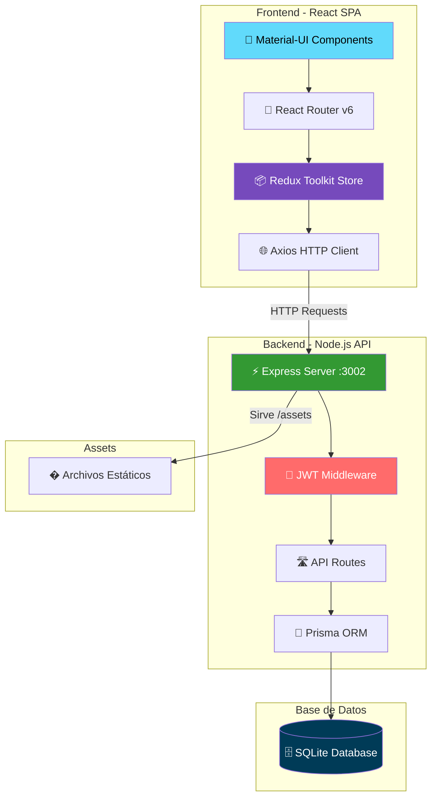

# 🚒 Sistema Administrativo de Bomberos - Full Stack

<div align="center">


**Sistema completo de administración para la Segunda Compañía de Bomberos Viña del Mar**

*Desarrollado con React + Node.js + SQLite + Prisma*

[](https://github.com/duoc-fullstack2-9v/team_16)
[](https://github.com/duoc-fullstack2-9v/team_16/tree/feature/proyecto-administracion-bomberos)

</div>

---

## ⚡ Quick Start

```bash
# 1. Clonar e instalar
git clone https://github.com/duoc-fullstack2-9v/team_16.git
cd team_16 && npm install

# 2. Configurar BD
cd server && npx prisma migrate dev && npx prisma generate
node prisma/seed-100-bomberos.js

# 3. Iniciar sistema
cd .. && npm run dev

# 4. Abrir navegador
# Frontend: http://localhost:5173
# Backend:  http://localhost:3002
# Login:    admin / 1234
```

---

## 📋 Tabla de Contenidos

- [🎯 Estado del Proyecto](#-estado-del-proyecto)
- [🏗️ Arquitectura](#️-arquitectura)
- [🚀 Tecnologías](#-tecnologías)
- [📋 Requisitos Previos](#-requisitos-previos)
- [🛠️ Instalación Rápida](#️-instalación-rápida)
- [👤 Credenciales de Prueba](#-credenciales-de-prueba)
- [📊 Datos de Prueba](#-datos-de-prueba-incluidos)
- [🎯 Módulos Funcionales](#-estado-del-sistema)
- [🔧 APIs Backend](#-apis-backend-implementadas)
- [🗄️ Esquema de Base de Datos](#️-esquema-de-base-de-datos)
- [📁 Estructura del Proyecto](#-estructura-del-proyecto)
- [🚀 Scripts Disponibles](#-scripts-disponibles)
- [🌟 Características](#-características-implementadas)
- [📊 Métricas](#-métricas-del-sistema)
- [🔧 Desarrollo](#-desarrollo-y-mantenimiento)
- [🚀 Mejoras Futuras](#-mejoras-futuras-sugeridas)
- [📞 Soporte](#-soporte-técnico)

---

## 🎯 Estado del Proyecto

**Estado**: ✅ **SISTEMA COMPLETO Y FUNCIONAL** | **PRODUCTION READY**

**Última actualización**: 23 de Octubre, 2025

### Características Principales:
- ✅ **100 Bomberos** con datos reales cargados
- ✅ **8 Módulos** completamente funcionales
- ✅ **60+ Endpoints** API REST implementados
- ✅ **24 Modelos** de base de datos relacionados
- ✅ **JWT Authentication** con seguridad completa
- ✅ **Material Mayor** (4 carros) + **Material Menor** (categorizado)
- ✅ **Sistema de Guardias** nocturnas con plantillas
- ✅ **Dashboard** con estadísticas en tiempo real

---

## 🏗️ Arquitectura

### Diagrama del Sistema



### Arquitectura en Capas

```
┌─────────────────────────────────────────────────────────────┐
│                    🌐 CAPA DE PRESENTACIÓN                   │
│  React 18 + Vite + Material-UI + Redux Toolkit              │
│  Puerto: 5173 (Dev) | Navegación SPA | Estado Global        │
└─────────────────────────────────────────────────────────────┘
                              ↕ HTTP/REST
┌─────────────────────────────────────────────────────────────┐
│                   ⚡ CAPA DE APLICACIÓN                      │
│  Express.js + JWT Auth + Middleware + CORS + Helmet         │
│  Puerto: 3002 | 60+ Endpoints | Validación Joi              │
└─────────────────────────────────────────────────────────────┘
                              ↕ Prisma Client
┌─────────────────────────────────────────────────────────────┐
│                    💾 CAPA DE DATOS                          │
│  Prisma ORM + SQLite | 24 Modelos | Migraciones             │
│  Relaciones: Many-to-Many, One-to-Many, Jerárquicas         │
└─────────────────────────────────────────────────────────────┘
                              ↕ SQL Queries
┌─────────────────────────────────────────────────────────────┐
│                  🗄️ BASE DE DATOS SQLite                     │
│  dev.db | 100+ Registros | Transacciones ACID               │
└─────────────────────────────────────────────────────────────┘
```

### Estructura de Directorios

```
�📁 sistema-bomberos-fullstack/
├── 📁 client/          # Frontend React + Vite + Material-UI
│   ├── src/
│   │   ├── components/    # Componentes reutilizables (50+)
│   │   ├── pages/         # 8 páginas principales
│   │   ├── store/         # Redux: 9 slices + store config
│   │   ├── services/      # API client (Axios)
│   │   └── utils/         # Utilidades y tema
│   └── vite.config.js     # Proxy /api → :3002, /assets → :3002
│
├── 📁 server/          # Backend Express + Prisma + SQLite
│   ├── src/
│   │   ├── routes/        # 10 archivos de rutas API
│   │   ├── middleware/    # Auth JWT + validaciones
│   │   └── utils/         # Helpers de autenticación
│   ├── prisma/
│   │   ├── schema.prisma  # 24 modelos relacionados
│   │   ├── migrations/    # 10 migraciones aplicadas
│   │   └── seed-100-bomberos.js  # Seed con datos
│   └── .env               # Variables de entorno
│
├── 📁 assets/          # Recursos estáticos (16MB)
│   └── bomberos/          # 8 fotos de bomberos
│
└── 📄 package.json     # Configuración del monorepo
```

### Flujo de Autenticación

```
┌──────────┐       ┌──────────┐       ┌──────────┐       ┌──────────┐
│  Login   │──────>│  Backend │──────>│   JWT    │──────>│LocalStore│
│  Form    │       │  /auth   │       │  Token   │       │  Token   │
└──────────┘       └──────────┘       └──────────┘       └──────────┘
                                            │
                                            ↓
┌──────────┐       ┌──────────┐       ┌──────────┐
│ Protected│<──────│ Axios    │<──────│ Bearer   │
│ Routes   │       │Interceptor│       │ Header   │
└──────────┘       └──────────┘       └──────────┘
```

## 🚀 Tecnologías

<div align="center">

### Stack Tecnológico Completo

| Categoría | Tecnologías |
|-----------|-------------|
| **Frontend** |    |
| **Estado** |   |
| **Backend** |   |
| **Base de Datos** |   |
| **Autenticación** |   |
| **Validación** |   |
| **HTTP Client** |  |
| **Seguridad** |   |

</div>

### Frontend
- **React 18.2.0** - Biblioteca de UI con Hooks
- **Vite 5.0.8** - Build tool ultra-rápido con HMR
- **Material-UI (MUI) 5.15.0** - Componentes de interfaz profesionales
- **Redux Toolkit 2.0.1** - Manejo de estado global simplificado
- **React Router 6.21.0** - Enrutamiento SPA declarativo
- **Axios 1.6.2** - Cliente HTTP con interceptores
- **Formik 2.4.6** - Manejo de formularios
- **Day.js 1.11.18** - Manipulación de fechas ligera

### Backend
- **Node.js** - Runtime JavaScript del lado del servidor
- **Express.js 4.18.2** - Framework web minimalista y rápido
- **Prisma 6.17.1** - ORM moderno con migraciones automáticas
- **SQLite** - Base de datos embebida, sin configuración
- **JWT (jsonwebtoken 9.0.2)** - Autenticación stateless
- **bcryptjs 2.4.3** - Hash de contraseñas seguro (12 salt rounds)
- **Joi 17.11.0** - Validación de esquemas declarativa
- **Helmet 7.1.0** - Seguridad de headers HTTP
- **CORS 2.8.5** - Control de acceso cross-origin
- **Morgan 1.10.0** - Logger de peticiones HTTP
- **PDFKit 0.17.2** - Generación de PDFs

### Herramientas de Desarrollo
- **Nodemon** - Hot reload del servidor
- **ESLint** - Linter de código
- **Concurrently** - Ejecución paralela de scripts

## 📋 Requisitos Previos

Antes de comenzar, asegúrate de tener instalado:

| Requisito | Versión Mínima | Recomendada | Verificar |
|-----------|----------------|-------------|-----------|
| Node.js | 16.0.0 | 18.x o superior | `node --version` |
| npm | 7.0.0 | 9.x o superior | `npm --version` |
| Git | 2.x | Última | `git --version` |

### Instalación de Requisitos

<details>
<summary>📦 Instalación en Windows</summary>

```powershell
# Descargar e instalar Node.js desde:
# https://nodejs.org/ (incluye npm)

# Verificar instalación
node --version
npm --version
```
</details>

<details>
<summary>🐧 Instalación en Linux</summary>

```bash
# Ubuntu/Debian
curl -fsSL https://deb.nodesource.com/setup_18.x | sudo -E bash -
sudo apt-get install -y nodejs

# Verificar instalación
node --version
npm --version
```
</details>

<details>
<summary>🍎 Instalación en macOS</summary>

```bash
# Usando Homebrew
brew install node

# Verificar instalación
node --version
npm --version
```
</details>

## 🛠️ Instalación Rápida

### Opción 1: Instalación Completa (Recomendada)

```bash
# 1️⃣ Clonar el repositorio
git clone https://github.com/duoc-fullstack2-9v/team_16.git
cd team_16
git checkout feature/proyecto-administracion-bomberos

# 2️⃣ Instalar todas las dependencias (root, client, server)
npm install

# 3️⃣ Configurar variables de entorno del backend
cd server
# Windows PowerShell:
Copy-Item .env.example .env
# Linux/Mac:
cp .env.example .env

# 4️⃣ Configurar base de datos SQLite
npx prisma migrate dev      # Crea BD y aplica migraciones
npx prisma generate          # Genera cliente Prisma

# 5️⃣ Cargar datos de prueba (100 bomberos + material + carros)
node prisma/seed-100-bomberos.js

# 6️⃣ Volver a la raíz e iniciar ambos servidores
cd ..
npm run dev
```

### Opción 2: Instalación Paso a Paso

```bash
# Client (Frontend)
cd client
npm install
npm run dev          # Puerto 5173

# Server (Backend) - En otra terminal
cd server
npm install

# ⚠️ IMPORTANTE: Crear archivo .env
# Windows PowerShell:
Copy-Item .env.example .env
# Linux/Mac:
cp .env.example .env

npx prisma migrate dev
npx prisma generate
node prisma/seed-100-bomberos.js
npm run dev          # Puerto 3002
```

### ⚠️ Problema Común: Error "Error interno del servidor"

Si al iniciar ves errores 500 en el login:

```bash
# El problema es que falta el archivo .env
cd server
Copy-Item .env.example .env   # Windows
# o
cp .env.example .env          # Linux/Mac

# Luego crear/migrar la base de datos
npx prisma migrate dev
node prisma/seed-100-bomberos.js

# Reiniciar servidor
cd ..
npm run dev
```

### ✅ Verificar Instalación

Después de ejecutar `npm run dev`, deberías ver:

```bash
🚒============================================🚒
   SISTEMA BOMBEROS - SERVIDOR INICIADO
🚒============================================🚒
🚀 Servidor corriendo en: http://localhost:3002
🌍 Environment: development
📊 Health Check: http://localhost:3002/health
📡 API Base: http://localhost:3002/api
🔒 CORS Origin: http://localhost:5173
⏰ Timestamp: ...
🚒============================================🚒

  VITE v5.0.8  ready in ... ms

  ➜  Local:   http://localhost:5173/
  ➜  Network: use --host to expose
```

**URLs del Sistema:**
- 🌐 **Frontend**: http://localhost:5173
- ⚡ **Backend API**: http://localhost:3002/api
- 🏥 **Health Check**: http://localhost:3002/health
- 🗄️ **Prisma Studio**: http://localhost:5555 (ejecutar `cd server && npx prisma studio`)

## 👤 Credenciales de Prueba

### Administrador
- **Usuario**: admin
- **Contraseña**: 1234

### Usuarios Bomberos
- **Email**: bombero@bomberos.cl
- **Contraseña**: bomb345

## 📊 Datos de Prueba Incluidos

El seed `seed-100-bomberos.js` carga:
- **100 Bomberos** chilenos con nombres reales
  - 85 en estado "Activo"
  - 10 en estado "Licencia"
  - 5 en estado "Inactivo"
  - Todos con rango "Bombero" (sin jerarquías)
  - Fotos asignadas cíclicamente (bombero-1.jpg a bombero-8.jpg)
- **12 Cargos** organizacionales (Administrativos, Operativos, Consejos)
- **5 Citaciones** de ejemplo
- **8 Categorías** de material (EPP, Herramientas, Comunicación, Médico)
- **8 Items de Material Menor** (cascos, radios, guantes, botiquines, etc.)
- **4 Carros Bomberos** (2 bombas, 1 escala, 1 rescate)

## 🎯 Estado del Sistema

### ✅ **MÓDULOS COMPLETAMENTE FUNCIONALES**

#### **1. 🔐 Sistema de Autenticación**
- Login/logout con JWT
- Protección de rutas
- Persistencia de sesión
- Validaciones frontend/backend

#### **2. 👨‍🚒 Módulo Bomberos** 
- ✅ CRUD completo con validación Joi
- ✅ **100 bomberos** cargados en base de datos
- ✅ Componentes React (BomberosList, BomberoForm, BomberoCard)
- ✅ Redux state management con async actions
- ✅ UI: Filtros por estado/rango, búsqueda, paginación (10 por página)
- ✅ Eliminación con confirmación
- ✅ Integración frontend-backend 100% funcional
- ✅ Fotos de perfil servidas desde backend (/assets/bomberos/)

#### **3. 📅 Módulo Citaciones**
- ✅ CRUD con relaciones complejas Citacion ↔ Bombero
- ✅ Asignación de bomberos a citaciones
- ✅ Control de asistencia post-evento
- ✅ Estadísticas y reportes
- ✅ Frontend: CitacionCard, CitacionForm, CitacionesList
- ✅ Redux: State management completo
- ✅ UI: Filtros avanzados, gestión de asistencia

#### **4. 👨‍💼 Módulo Cargos (Oficiales)**
- ✅ CRUD completo para cargos organizacionales
- ✅ Sistema de 3 ramas: ADMINISTRATIVA, OPERATIVA, CONSEJOS
- ✅ 12 cargos con jerarquías y límites de ocupantes
- ✅ Asignación de bomberos a cargos
- ✅ Historial de asignaciones con períodos
- ✅ Estadísticas por rama y jerarquía
- ✅ Frontend: CargosList, AsignarCargoDialog, LiberarCargoDialog
- ✅ Backend: Rutas corregidas (/estadisticas antes de /:id)

#### **5. 🧰 Módulo Material Menor**
- ✅ CRUD completo de material
- ✅ Sistema de categorías jerárquico (padre-hijo)
- ✅ Tipos: Individual (con N° serie) y Cantidad (con stock)
- ✅ 8 categorías organizadas (EPP, Herramientas, Comunicación, Médico)
- ✅ Control de ubicación física y fechas
- ✅ Estadísticas y alertas de stock
- ✅ Asignación de material a bomberos y carros

#### **6. 🚛 Módulo Material Mayor (Carros)**
- ✅ CRUD de carros bomberos
- ✅ 4 carros implementados (Bombas, Escala, Rescate)
- ✅ Gestión de cajoneras por carro
- ✅ Asignación de material a cajoneras
- ✅ Historial de cambios y mantenciones
- ✅ Conductores habilitados por carro
- ✅ Estadísticas operacionales
- ✅ Sistema de tabs (Carros, Cajoneras, Historial)

#### **7. 🌙 Módulo Guardias Nocturnas**
- ✅ Creación de guardias mensuales
- ✅ Sistema de plantillas reutilizables
- ✅ Asignación de bomberos por día
- ✅ Calendario visual mensual
- ✅ Control de disponibilidad de bomberos

#### **8. 📊 Dashboard Administrativo**
- ✅ Estadísticas generales del sistema
- ✅ Métricas de bomberos por estado
- ✅ Resumen de citaciones
- ✅ Estado de cargos organizacionales
- ✅ Alertas de material y carros
- ✅ Interfaz responsive con Material-UI

## 🔧 APIs Backend Implementadas

### Autenticación
```
POST /api/auth/login     # Login con email/password o usuario
POST /api/auth/logout    # Logout (limpia token)
GET  /api/auth/me        # Datos del usuario autenticado
```

### Bomberos
```
GET    /api/bomberos                    # Lista con filtros y paginación
POST   /api/bomberos                    # Crear nuevo bombero
GET    /api/bomberos/:id                # Obtener bombero específico
PUT    /api/bomberos/:id                # Actualizar bombero
DELETE /api/bomberos/:id                # Eliminar bombero
GET    /api/bomberos/stats/general      # Estadísticas generales
```

### Cargos
```
GET    /api/cargos                      # Lista de todos los cargos
POST   /api/cargos                      # Crear nuevo cargo
GET    /api/cargos/estadisticas         # Estadísticas por rama
GET    /api/cargos/:id                  # Obtener cargo específico
PUT    /api/cargos/:id                  # Actualizar cargo
DELETE /api/cargos/:id                  # Eliminar cargo
POST   /api/cargos/:id/asignar          # Asignar bombero a cargo
POST   /api/cargos/:id/liberar          # Liberar cargo
GET    /api/cargos/:id/historial        # Historial de asignaciones
```

### Citaciones
```
GET    /api/citaciones                                          # Lista con filtros
POST   /api/citaciones                                          # Crear citación
GET    /api/citaciones/:id                                      # Detalles específicos
PUT    /api/citaciones/:id                                      # Actualizar citación
DELETE /api/citaciones/:id                                      # Eliminar citación
POST   /api/citaciones/:id/asignar                             # Asignar bomberos
PUT    /api/citaciones/:id/bomberos/:bomberoId/asistencia      # Control asistencia
GET    /api/citaciones/stats/general                           # Estadísticas
```

### Material Menor
```
GET    /api/material                    # Lista de material
POST   /api/material                    # Crear material
GET    /api/material/:id                # Obtener material específico
PUT    /api/material/:id                # Actualizar material
DELETE /api/material/:id                # Eliminar material
GET    /api/material/estadisticas       # Estadísticas de material
GET    /api/material/alertas            # Alertas de stock bajo
POST   /api/material/:id/asignar        # Asignar a bombero/carro
```

### Categorías
```
GET    /api/categorias                  # Árbol de categorías
POST   /api/categorias                  # Crear categoría
GET    /api/categorias/:id              # Obtener categoría
PUT    /api/categorias/:id              # Actualizar categoría
DELETE /api/categorias/:id              # Eliminar categoría
```

### Material Mayor (Carros)
```
GET    /api/carros                      # Lista de carros
POST   /api/carros                      # Crear carro
GET    /api/carros/:id                  # Obtener carro específico
PUT    /api/carros/:id                  # Actualizar carro
DELETE /api/carros/:id                  # Eliminar carro
GET    /api/carros/estadisticas         # Estadísticas operacionales
GET    /api/carros/alertas              # Alertas de mantenimiento
POST   /api/carros/:id/cajoneras        # Crear cajonera
PUT    /api/carros/:id/cajoneras/:cid   # Actualizar cajonera
DELETE /api/carros/:id/cajoneras/:cid   # Eliminar cajonera
POST   /api/carros/:id/conductores      # Habilitar conductor
```

### Guardias Nocturnas
```
GET    /api/guardias/mensuales          # Lista de guardias mensuales
POST   /api/guardias/mensuales          # Crear guardia mensual
GET    /api/guardias/mensuales/:id      # Obtener guardia específica
PUT    /api/guardias/mensuales/:id      # Actualizar guardia
DELETE /api/guardias/mensuales/:id      # Eliminar guardia
POST   /api/guardias/mensuales/:id/aplicar-plantilla  # Aplicar plantilla
GET    /api/guardias/plantillas         # Lista de plantillas
POST   /api/guardias/plantillas         # Crear plantilla
GET    /api/guardias/bomberos           # Bomberos disponibles para guardia
```

## 🗄️ Esquema de Base de Datos

```sql
-- Usuarios del sistema
User (id, email, password, nombre, rol, tipo, activo, createdAt, updatedAt)

-- Bomberos (100 registros)
Bombero (id, nombres, apellidos, rango, especialidad, estado, telefono, email, direccion, fechaIngreso, fotoUrl, createdById, createdAt, updatedAt)

-- Cargos organizacionales (12 registros)
Cargo (id, nombre, descripcion, rama, jerarquia, maxOcupantes, activo, createdAt, updatedAt)

-- Asignaciones de cargos
AsignacionCargo (id, cargoId, bomberoId, fechaInicio, fechaFin, periodoAnio, activo, observaciones, createdAt, updatedAt)

-- Citaciones
Citacion (id, titulo, fecha, hora, lugar, motivo, estado, createdById, createdAt, updatedAt)

-- Relación Many-to-Many Bomberos ↔ Citaciones
BomberoCitacion (id, bomberoId, citacionId, asistio, observaciones, createdAt)

-- Categorías de material (jerárquico)
Categoria (id, nombre, descripcion, icono, parentId, activo, createdAt, updatedAt)

-- Material menor (8 items)
Material (id, nombre, descripcion, categoriaId, estado, tipo, numeroSerie, cantidad, unidadMedida, fechaAdquisicion, ubicacionFisica, activo, createdAt, updatedAt)

-- Asignaciones de material
AsignacionMaterial (id, materialId, bomberoId, carroId, cajoneraId, cantidad, fechaAsignacion, fechaDevolucion, estadoDevolucion, observaciones, createdAt)

-- Carros bomberos (4 registros)
Carro (id, nombre, tipo, marca, modelo, anioFabricacion, patente, estadoOperativo, capacidadAgua, capacidadEspuma, potenciaMotobomba, caracteristicas, activo, createdAt, updatedAt)

-- Cajoneras por carro
Cajonera (id, carroId, nombre, descripcion, posicion, capacidad, activo, createdAt, updatedAt)

-- Conductores habilitados
ConductorHabilitado (id, carroId, bomberoId, fechaHabilitacion, vigente, observaciones, createdAt, updatedAt)

-- Historial de carros
HistorialCarro (id, carroId, tipo, descripcion, fecha, realizadoPor, createdAt)

-- Guardias mensuales
GuardiaMensual (id, mes, anio, descripcion, activo, createdAt, updatedAt)

-- Días de guardia
GuardiaDia (id, guardiaMensualId, dia, activo, observaciones, createdAt)

-- Bomberos por día de guardia
GuardiaDiaBombero (id, guardiaDiaId, bomberoId, rol, observaciones, createdAt)

-- Plantillas de guardias
PlantillaGuardia (id, nombre, descripcion, activo, createdAt, updatedAt)
PlantillaDia (id, plantillaGuardiaId, numeroDia, nombreDia, createdAt)
PlantillaDiaBombero (id, plantillaDiaId, posicion, createdAt)
```

## 📁 Estructura del Proyecto

### Client (Frontend React)
```
client/
├── src/
│   ├── components/         # Componentes reutilizables
│   │   ├── Layout.jsx      # ✅ Layout principal con navegación
│   │   ├── ProtectedRoute.jsx # ✅ Rutas protegidas por autenticación
│   │   ├── ErrorBoundary.jsx  # ✅ Manejo de errores React
│   │   ├── bomberos/       # ✅ BomberoCard, BomberoForm, BomberosList
│   │   ├── cargos/         # ✅ CargosList, AsignarCargoDialog, etc.
│   │   ├── citaciones/     # ✅ CitacionCard, CitacionForm, etc.
│   │   ├── carros/         # ✅ CarroCard, CarroForm, CajoneraForm, etc.
│   │   └── guardias/       # ✅ Plantillas, calendario mensual
│   ├── pages/              # Páginas de la aplicación
│   │   ├── LoginPage.jsx   # ✅ Login funcional con validación
│   │   ├── DashboardPage.jsx # ✅ Dashboard con estadísticas
│   │   ├── BomberosPage.jsx  # ✅ Gestión de 100 bomberos
│   │   ├── CitacionesPage.jsx # ✅ Gestión de citaciones
│   │   ├── OficialesPage.jsx  # ✅ Gestión de cargos
│   │   ├── MaterialMenorPage.jsx # ✅ Gestión de material
│   │   ├── MaterialMayorPage.jsx # ✅ Gestión de carros
│   │   ├── GuardiasPage.jsx      # ✅ Guardias nocturnas
│   │   └── AdminPage.jsx   # ✅ Panel admin
│   ├── store/              # Redux store
│   │   ├── index.js        # ✅ Store configurado con serialization
│   │   └── slices/         # Slices de Redux
│   │       ├── authSlice.js       # ✅ Autenticación
│   │       ├── bomberosSlice.js   # ✅ Bomberos
│   │       ├── citacionesSlice.js # ✅ Citaciones
│   │       ├── cargosSlice.js     # ✅ Cargos
│   │       ├── materialSlice.js   # ✅ Material menor
│   │       ├── categoriasSlice.js # ✅ Categorías
│   │       ├── carrosSlice.js     # ✅ Material mayor
│   │       ├── guardiasSlice.js   # ✅ Guardias
│   │       └── oficialesSlice.js  # ✅ Oficiales
│   ├── services/
│   │   └── api.js          # ✅ Cliente Axios (corregido serialization)
│   ├── utils/
│   │   └── theme.js        # ✅ Tema Material-UI personalizado
│   └── main.jsx            # ✅ Punto de entrada React
├── index.html              # HTML principal
├── vite.config.js          # ✅ Vite con proxy /api y /assets
└── package.json           # Dependencias frontend
```

### Server (Backend Node.js)
```
server/
├── src/
│   ├── routes/             # Rutas de la API
│   │   ├── auth.js         # ✅ Autenticación JWT
│   │   ├── bomberos.js     # ✅ CRUD bomberos
│   │   ├── citaciones.js   # ✅ CRUD citaciones
│   │   ├── cargos.js       # ✅ CRUD cargos (corregido routing)
│   │   ├── material.js     # ✅ CRUD material menor
│   │   ├── categorias.js   # ✅ CRUD categorías
│   │   ├── carros.js       # ✅ CRUD carros y cajoneras
│   │   ├── guardias.js     # ✅ CRUD guardias
│   │   ├── oficiales.js    # ✅ CRUD oficiales
│   │   └── admin.js        # ✅ Rutas administrativas
│   ├── middleware/
│   │   └── auth.js         # ✅ Middleware JWT con verificación
│   ├── utils/
│   │   └── auth.js         # ✅ Utilidades de autenticación
│   └── index.js            # ✅ Servidor Express configurado
├── prisma/
│   ├── schema.prisma       # ✅ Esquema completo (24 modelos)
│   ├── seed.js             # ✅ Seed original (10 bomberos)
│   ├── seed-100-bomberos.js # ✅ Seed nuevo (100 bomberos + material)
│   └── migrations/         # ✅ 10 migraciones aplicadas
├── .env                    # ✅ Variables de entorno (JWT_SECRET, etc.)
├── .env.example            # Plantilla de variables
└── package.json            # Dependencias backend
```

### Assets
```
assets/
└── bomberos/
    ├── bombero-1.jpg       # ✅ 1.6 MB
    ├── bombero-2.jpg       # ✅ 2.1 MB
    ├── bombero-3.jpg       # ✅ 2.0 MB
    ├── bombero-4.jpg       # ✅ 2.0 MB
    ├── bombero-5.jpg       # ✅ 2.0 MB
    ├── bombero-6.jpg       # ✅ 2.1 MB
    ├── bombero-7.jpg       # ✅ 2.0 MB
    ├── bombero-8.jpg       # ✅ 2.0 MB
    └── README.md           # Documentación de assets
```

## 🚀 Scripts Disponibles

| Script | Descripción |
|--------|-------------|
| `npm run dev` | Ejecuta client (5173) y server (3002) en modo desarrollo |
| `npm run dev:client` | Solo frontend en modo desarrollo |
| `npm run dev:server` | Solo backend en modo desarrollo |
| `npm run install:all` | Instala dependencias de root, client y server |
| `npm run build` | Construye client y server para producción |
| `npm run start` | Inicia el servidor en producción |
| `npm run prisma:studio` | Abre Prisma Studio (GUI para BD) |
| `npm run prisma:migrate` | Ejecuta migraciones pendientes |
| `npm run prisma:generate` | Regenera cliente Prisma |

### Scripts de Base de Datos
```bash
cd server

# Ver datos en Prisma Studio (GUI)
npx prisma studio

# Aplicar migraciones
npx prisma migrate dev

# Generar cliente Prisma
npx prisma generate

# Cargar 100 bomberos + material + carros
node prisma/seed-100-bomberos.js

# Cargar seed original (10 bomberos)
node prisma/seed.js

# Reset completo de BD
npx prisma migrate reset
```

## 🌟 Características Implementadas

### Frontend
- ✅ **Material-UI 5**: Interfaz profesional y responsive
- ✅ **Redux Toolkit 2**: Manejo de estado global con 9 slices
- ✅ **React Router 6**: Navegación SPA con rutas protegidas
- ✅ **Vite 5**: Build tool con HMR y proxy configurado
- ✅ **Formularios**: Validación completa y manejo de errores
- ✅ **Tablas**: Paginación, filtros avanzados, búsqueda
- ✅ **Modales**: Confirmaciones, asignaciones, detalles
- ✅ **Loading States**: Skeletons y spinners
- ✅ **Error Handling**: ErrorBoundary y manejo global
- ✅ **Optimizaciones**: SerializableCheck configurado correctamente

### Backend
- ✅ **API REST**: 60+ endpoints CRUD completos
- ✅ **Validación**: Joi schemas en todos los endpoints
- ✅ **Autenticación**: JWT con middleware de protección
- ✅ **Base de Datos**: Prisma ORM con SQLite
- ✅ **Relaciones**: Many-to-many, One-to-many, jerárquicas
- ✅ **Transacciones**: Operaciones atómicas en asignaciones
- ✅ **Estadísticas**: Endpoints agregados para dashboards
- ✅ **CORS**: Configurado para desarrollo seguro
- ✅ **Assets**: Servidor de archivos estáticos (/assets)
- ✅ **Migraciones**: 10 migraciones aplicadas

### Seguridad
- ✅ **JWT**: Tokens seguros con expiración configurable
- ✅ **bcrypt**: Encriptación de contraseñas con salt rounds 12
- ✅ **Validación**: Doble validación frontend y backend
- ✅ **CORS**: Configuración restrictiva por origen
- ✅ **Middleware**: Protección de rutas sensibles
- ✅ **Environment**: Variables sensibles en .env

## 📊 Métricas del Sistema

<div align="center">

| Métrica | Valor | Descripción |
|---------|-------|-------------|
| 📁 **Archivos** | 98 | Archivos de código y configuración (sin `node_modules` ni `dist`) |
| 📝 **Líneas de Código** | 22,340 | Total de líneas (medición 23-oct-2025) |
| 🚀 **Endpoints API** | 60+ | Endpoints REST funcionales |
| 📄 **Páginas React** | 9 | Páginas principales del sistema |
| 🧩 **Componentes** | 50+ | Componentes reutilizables |
| 🗂️ **Modelos BD** | 24 | Modelos Prisma activos |
| 🔄 **Redux Slices** | 9 | Slices de estado global |
| 📦 **Migraciones** | 10 | Migraciones aplicadas |
| 🖼️ **Assets** | 10 archivos | ~16MB de recursos |
| ⚡ **Funcionalidad** | 100% | Sistema completamente funcional |
| 👨‍🚒 **Bomberos** | 100 | Registros de bomberos cargados |
| 🚛 **Carros** | 4 | Vehículos de emergencia |
| 📋 **Cargos** | 12 | Cargos organizacionales |
| 🧰 **Material Menor** | 8+ | Items de material catalogados |

_Métricas actualizadas automáticamente con `Get-ChildItem` + `Measure-Object` el 23-oct-2025._

### Distribución del Código

```
Frontend (React)     ████████████████░░░░  55%  ~12,200 líneas
Backend (Node.js)    █████████░░░░░░░░░░░  27%   ~6,100 líneas
Base de Datos        ████░░░░░░░░░░░░░░░░  13%   ~3,000 líneas
Configuración        ██░░░░░░░░░░░░░░░░░░   5%   ~1,000 líneas
```

</div>

## 🎯 Funcionalidades Avanzadas

### Dashboard
- Estadísticas generales del sistema en tiempo real
- Métricas de bomberos por estado (Activo, Licencia, Inactivo)
- Resumen de citaciones programadas y realizadas
- Estado de ocupación de cargos organizacionales
- Alertas de material con stock bajo
- Alertas de carros en mantenimiento

### Gestión de Bomberos (100 registros)
- CRUD completo con validaciones frontend y backend
- Filtros por rango, estado, especialidad
- Búsqueda en tiempo real por nombre
- Paginación eficiente (10 por página, 10 páginas)
- Fotos de perfil servidas desde backend
- Estadísticas generales agregadas

### Gestión de Citaciones
- CRUD completo con asignación múltiple de bomberos
- Control de asistencia post-evento
- Filtros por estado, fecha, tipo
- Estadísticas de participación
- Historial completo de asistencias

### Gestión de Cargos
- Sistema de 3 ramas organizacionales (Administrativa, Operativa, Consejos)
- 12 cargos con jerarquías y límites de ocupantes
- Asignación con períodos anuales
- Liberación de cargos con fechas
- Historial completo de asignaciones
- Estadísticas por rama

### Gestión de Material Menor
- CRUD con categorías jerárquicas (padre-hijo)
- Tipos: Individual (N° serie) y Cantidad (stock)
- Control de ubicación física
- Alertas de stock mínimo
- Asignación a bomberos y carros
- Historial de asignaciones

### Gestión de Carros (Material Mayor)
- 4 carros bomberos (Bombas, Escala, Rescate)
- Sistema de cajoneras por carro
- Asignación de material a cajoneras
- Conductores habilitados
- Historial de cambios y mantenciones
- Características técnicas en JSON
- Alertas de mantención programada

### Guardias Nocturnas
- Creación de calendarios mensuales
- Sistema de plantillas reutilizables
- Asignación de bomberos por día
- Vista de calendario visual
- Control de disponibilidad

## 🔧 Desarrollo y Mantenimiento

### Variables de Entorno
```env
# server/.env
DATABASE_URL="file:./dev.db"
JWT_SECRET="tu-secreto-jwt-super-seguro-2025"
JWT_EXPIRES_IN="24h"
NODE_ENV="development"
PORT=3002
CORS_ORIGIN="http://localhost:5173"
```

### Puertos Configurados
- **Frontend (Vite)**: 5173
- **Backend (Express)**: 3002
- **Prisma Studio**: 5555 (cuando se ejecuta)

### Comandos Útiles
```bash
# Desarrollo diario
npm run dev                    # Inicia frontend (5173) y backend (3002)

# Base de datos
cd server
npx prisma studio             # Interface gráfica BD (puerto 5555)
npx prisma migrate reset      # Resetear BD completa
node prisma/seed-100-bomberos.js  # Cargar 100 bomberos

# Debug y producción
cd client && npm run build    # Build frontend para producción
cd server && npm start        # Servidor en modo producción

# Git
git status                     # Ver estado de cambios
git add .                      # Agregar todos los cambios
git commit -m "mensaje"        # Commit con mensaje
git push origin feature/proyecto-administracion-bomberos  # Push a rama
```

## 🚀 Mejoras Futuras Sugeridas

### Funcionalidades Adicionales
- [ ] **Reportes PDF**: Exportación de listados y estadísticas
- [ ] **Exportación Excel**: Datos de bomberos, material, carros
- [ ] **Notificaciones Push**: Sistema de alertas en tiempo real
- [ ] **Calendario Completo**: Vista calendario para citaciones y guardias
- [ ] **Gestión de Cursos**: Módulo de capacitaciones y certificaciones
- [ ] **Sistema de Licencias**: Control de licencias médicas y permisos
- [ ] **Chat Interno**: Mensajería entre bomberos
- [ ] **App Móvil**: React Native para iOS/Android
- [ ] **Firma Digital**: Firma de asistencias y documentos
- [ ] **Geolocalización**: Ubicación de bomberos en servicio

### Optimizaciones Técnicas
- [ ] **Testing**: Jest + React Testing Library + Vitest
- [ ] **Performance**: 
  - Lazy loading de componentes
  - Memoización con useMemo/useCallback
  - Virtual scrolling para listas largas
- [ ] **PWA**: Service workers, offline first, instalable
- [ ] **Docker**: Contenedorización completa (docker-compose)
- [ ] **CI/CD**: GitHub Actions para deploy automático
- [ ] **Monitoring**: Sentry para errores, Analytics
- [ ] **SEO**: Optimización para motores de búsqueda
- [ ] **i18n**: Internacionalización (español/inglés)

### Escalabilidad
- [ ] **PostgreSQL**: Migración de SQLite a PostgreSQL
- [ ] **Redis**: Cache para sesiones y queries frecuentes
- [ ] **S3/CloudStorage**: Almacenamiento de fotos en la nube
- [ ] **Load Balancer**: Escalado horizontal del backend
- [ ] **Microservicios**: Separación de módulos en servicios independientes

## 📞 Soporte Técnico

### Enlaces Útiles
- [React Documentation](https://react.dev/)
- [Material-UI Components](https://mui.com/)
- [Prisma Documentation](https://www.prisma.io/)
- [Express.js Guide](https://expressjs.com/)

### Debug Common Issues

#### 🔴 Puerto ocupado (Windows)
```powershell
# Verificar qué proceso usa el puerto
netstat -ano | findstr :3002
netstat -ano | findstr :5173

# Matar el proceso (reemplazar <PID> con el número obtenido)
taskkill /F /PID <PID>
```

#### 🔴 Problemas de dependencias
```bash
# Limpiar todo y reinstalar
rm -rf node_modules client/node_modules server/node_modules package-lock.json
npm install
```

#### 🔴 Problemas de Base de Datos
```bash
cd server
npx prisma migrate reset    # ⚠️ Resetea todo (borra datos)
npx prisma generate          # Regenera cliente Prisma
node prisma/seed-100-bomberos.js  # Recarga datos
```

#### 🔴 Limpiar cache de Vite
```bash
cd client
rm -rf node_modules/.vite dist
npm run dev
```

#### 🔴 Error: "Cannot find module '@prisma/client'"
```bash
cd server
npx prisma generate
```

#### 🔴 Error de serialización en Redux
- ✅ Verificar que `client/src/store/index.js` tenga `serializableCheck` configurado
- ✅ Verificar que `client/src/services/api.js` retorne `{data, status, statusText}`

#### 🔴 Token JWT expirado o inválido
- Cerrar sesión y volver a iniciar sesión
- Verificar que `JWT_SECRET` en `.env` sea consistente
- Limpiar localStorage del navegador

#### 🔴 CORS errors
- Verificar que backend esté en puerto 3002
- Verificar configuración de proxy en `client/vite.config.js`
- Verificar `CORS_ORIGIN` en `server/.env`

#### 🔴 Base de datos bloqueada (SQLite)
```bash
cd server
# Cerrar todas las conexiones a la BD
rm dev.db dev.db-journal
npx prisma migrate dev
node prisma/seed-100-bomberos.js
```

### 🆘 Soporte Adicional

Si los problemas persisten:

1. **Revisar logs**: Buscar errores en la consola del navegador y terminal
2. **Verificar versiones**: Node.js >= 16.0.0, npm >= 7.0.0
3. **Issues en GitHub**: [Crear un issue](https://github.com/duoc-fullstack2-9v/team_16/issues)
4. **Documentación oficial**:
   - [React](https://react.dev/)
   - [Prisma](https://www.prisma.io/docs)
   - [Material-UI](https://mui.com/)
   - [Express](https://expressjs.com/)

## 📚 Documentación Adicional

### Archivos Importantes
- `README.md` - Este archivo (documentación general)
- `server/prisma/schema.prisma` - Esquema completo de la BD
- `server/.env.example` - Plantilla de variables de entorno
- `assets/bomberos/README.md` - Información de assets
- `client/vite.config.js` - Configuración de Vite con proxies
- `server/prisma/seed-100-bomberos.js` - Seed con 100 bomberos

### Rutas Principales del Sistema
- `/` - Login
- `/dashboard` - Dashboard principal
- `/bomberos` - Gestión de 100 bomberos
- `/citaciones` - Citaciones y asistencias
- `/oficiales` - Cargos organizacionales
- `/material` - Material menor
- `/carros` - Material mayor (carros)
- `/guardias` - Guardias nocturnas
- `/admin` - Panel administrativo

---

<div align="center">

## 🚒 Segunda Compañía de Bomberos Viña del Mar

### *Sistema de Gestión Administrativa Completo v2.0*

---

**Estado**: ✅ **PRODUCTION READY** - Sistema 100% funcional  
**Stack**: React 18 + Vite 5 + Node.js + Express + SQLite + Prisma 6 + Material-UI 5  
**Módulos**: Autenticación • Bomberos (100) • Citaciones • Cargos • Material Menor • Carros • Guardias  

---

[](https://github.com/duoc-fullstack2-9v/team_16)
[](https://github.com/duoc-fullstack2-9v/team_16/tree/feature/proyecto-administracion-bomberos)
[](https://github.com/duoc-fullstack2-9v/team_16)
[](LICENSE)

---

**Desarrollado con ❤️ por el equipo de desarrollo**  
**Duoc UC - Full Stack 2 - 2025**

📧 Contacto: [GitHub Issues](https://github.com/duoc-fullstack2-9v/team_16/issues)  
📚 Documentación: [README.md](README.md) | [Wiki](https://github.com/duoc-fullstack2-9v/team_16/wiki)

---

### ⭐ Si este proyecto te fue útil, no olvides darle una estrella en GitHub

</div>